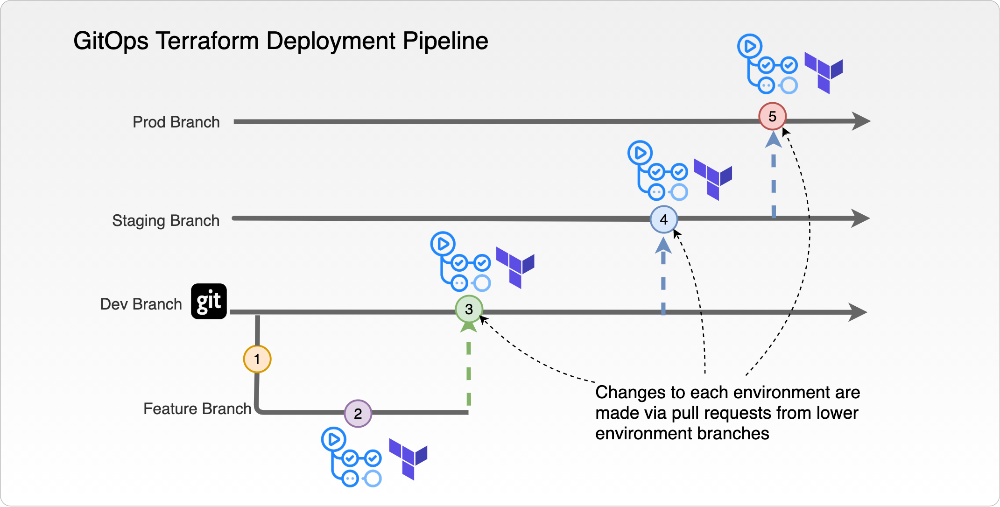

# HashzureOps

This repository contains the demo code used during Liatrio's visit on HashiCorp Live.

## Overview

This repository contains the source code that was used during HashiCorp Live. [Liatrio](https://www.liatrio.com/)
visited to discuss GitOps with [Terraform](https://www.terraform.io) based infrastructure. 

GitOps is a term originally coined by [Weaveworks](https://www.weave.works/technologies/gitops/). It was originally
conceived for use in the Kubernetes and container space. Liatrio has worked to implement GitOps with clients who are
not yet on Kubernetets by using tools including Terraform and [Terragrunt](https://github.com/gruntwork-io/terragrunt). 
For more information on GitOps check out the _Useful links_ down below for blogs and other documentation.

This demo uses [Microsoft Azure](https://azure.microsoft.com/en-us/) as the public cloud platform. The processes are
automated using [GitHub Actions](https://github.com/features/actions). More specific information on the actions are in the _Actions_ section of this README.
 
---

## Technical Requirements

The following tools must be available for this to run:

* [Terraform](https://www.terraform.io/) (>= 0.13.5)
* [Terragrunt](https://github.com/gruntwork-io/terragrunt) (>= 0.23.31)
* [Azure CLI](https://docs.microsoft.com/en-us/cli/azure/)

--- 

## Repository Structure

├── bootstrap  
│   ├── local  
│   ├── remote  
│   ├── terraform  
│   └── _terragrunt.hcl_  
├── environments  
│   ├── dev  
│   ├── prod  
│   ├── staging  
│   └── _terragrunt.hcl_  
├── shared  
│   └── _terragrunt.hcl_  
└── stages  
    ├── app  
    └── shared  

### Stages - Terraform

The stages directory contains the Terraform that will be used during deployments. The two directories of Terraform
include `app` and `shared`. The `shared` directory contains Terraform that will set up common tools like the 
[Azure Container Registry](https://azure.microsoft.com/en-us/services/container-registry/). The `app` directory will
include the Terraform to set up the app service and deploy that app.

### Bootstrap Directory

The `bootstrap` directory contains the Terraform and tools required to bootstrap an
[Azure Subscription](https://docs.microsoft.com/en-us/microsoft-365/enterprise/subscriptions-licenses-accounts-and-tenants-for-microsoft-cloud-offerings?view=o365-worldwide#subscriptions)
to be used later. There is local and remote information for Terraform state. 

### Environments Directory

The environments directory contains a directory for each environment. Terragrunt configuration files are stored in each. 
That configuration file contains the information that is unique to each environment including Terraform state 
configuration and inputs. 

The top-level `terragrunt.hcl` contains configuration that is used througout all of the environments. This includes
information including where the Terraform source code lives, lock setup, and common variables. This information is
included by using the `include` Terragrunt feature with `find_in_parent_folders()` function. 

### Shared 

The shared directory contains Terragrunt config that will be used to run the Terraform in the `stages/shared` directory
mentioned above.

---

## Actions

There are two GitHub Action workflows included in this repository:

* [terraform-validate.yml](.github/workflows/terraform-deploy.yml)
* [terraform-deploy.yml](.github/workflows/terraform-deploy.yml)

### Terraform Validate

This workflow exists to validate Terraform code and proposed infrastructure. This workflow includes [TFLint](https://github.com/terraform-linters/tflint),
Terraform CLI's [`fmt`](https://www.terraform.io/docs/commands/fmt.html), [`validate`](https://www.terraform.io/docs/commands/validate.html),
and [`plan`](https://www.terraform.io/docs/commands/plan.html) commands. It is also built using
[GitHub Actions' build matrix](https://docs.github.com/en/free-pro-team@latest/actions/learn-github-actions/managing-complex-workflows#using-a-build-matrix) feature
to validate against the various environments.

It flows as follows:

* **Validate Stages**
  * Installs TFLint
  * Runs `terraform fmt`
  * Runs TFLint
* **Validate Environments**
  * Run `terraform init`
  * Run `terraform validate`
  * Run `terraform plan`

This workflow is triggered on pull requests to the environment branches -- `dev`, `staging`, `prod` -- and on commits to all branches _except_ the environment branches.

### Terraform Deploy

This workflow does the actual application of Terraform. This workflow only triggers on a push to one of the environment
branches -- `dev`, `staging`, `prod`. A few of the same mechanisms from the _Terraform Validate_ workflows are used here
but this workflow also handles Terraform application and opening subsequent PRs to higher environments.

Jobs flow as follows:

* **Create Deployment**
  * Create a GitHub Deployment
  * This deployment will be updated to _failure_ if any of the Terraform steps fail.
  * This will be used to determine if a PR to later environments should be opened
* **Validate Stages**
  * Run `terraform fmt`
  * Run TFLint
  * Update GitHub Deployment from first job if failure
* **Validate Environment**
  * Extract branch name for use in later steps
  * Run `terraform fmt`
  * Run `terraform init` passing in branch name from _Extract branch name_ step as working directory
  * Run `terraform validate` with same working dir as previous step
  * Update GitHub Deployment from first job if failure
* **Plan Environment**
  * Extract branch name for use in later steps
  * Run `terraform init` passing in branch name from _Extract branch name_ step as working directory
  * Run `terraform plan` with same working dir as previous step
  * Update GitHub Deployment from first job if failure
* **Apply**
  * Extract branch name for use in later steps
  * Run `terraform init` passing in branch name from _Extract branch name_ step as working directory
  * Update GitHub Deployment from first job with *in_progress*
  * Run `terraform apply` with same working dir as `init` step
  * Set Terraform outputs forlater use
  * If successful, change deployment status to _pending_; otherwise set to _failure_
* **Test Env -- Run Integration Tests**
  * Get Terraform output from the apply job
  * Get app URL from the apply job
  * Run integration tests
  * If successful, change deployment status to _success_, otherwise set to _failure_
* **Deploy Success**
  * If all jobs prior to this are success, set deployment status to _success_
* **Create Staging PR**
  * Create a pr from `dev` to `staging` branch if the deployment was success in the `dev` environment
* **Create Prod PR**
  * Create a pr from `staging` to `prod` branch if the deployment was success in the `staging` environment

---

## Useful Links 

* [Terraform](https://www.terraform.io)
* [Terragrunt](https://github.com/gruntwork-io/terragrunt)
* [Weaveworks - GitOps](https://www.weave.works/technologies/gitops/)
* [Liatrio Blog - Using GitOps for Enterprise Delivery](https://www.liatrio.com/blog/gitops-enterprise-application-delivery)

